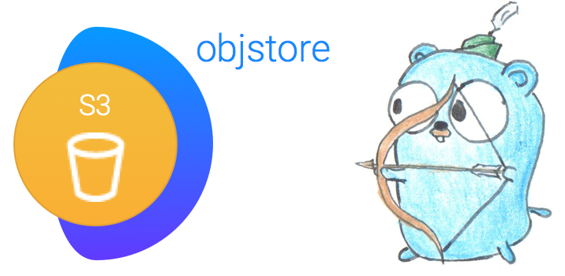
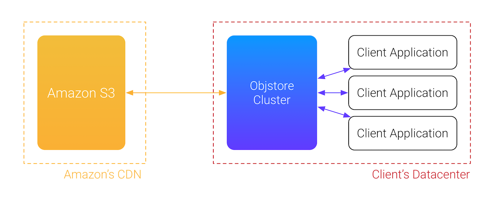
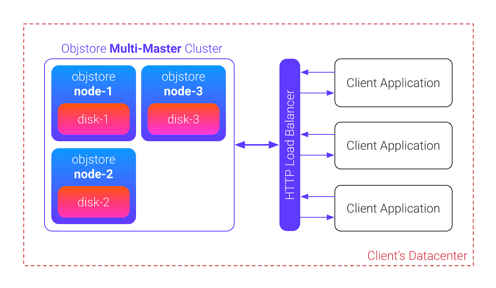

<p align="center">
    
</p>

# objstore [](https://goreportcard.com/report/sphere.software/objstore) 
_A Multi-Master Distributed Caching Layer for Amazon S3_

This project aims to provide an easy to use, self-organising multi-master caching layer for various cloud stoarge backends, e.g. S3. It combines functionality of a simple object storage with added robustness of cross-node journal synchronisation, object replication and cluster auto-discovery.

We know that Amazon S3 has proven to be fast and reliable, a PaaS solution that acts like a
backbone for many business applications. But the cost of service may become too high
depending on your usage patterns, for example, if your application runs in your own datacenter, then
the file transfer costs will skyrocket. Also request frequency has its limits.

**Objstore Cluster** aims to mitigate this problem, it's supposed to be running in your datacenter, implementing a near-cache for all files. Its API allows to upload, head, read and delete files by key, like any other object. All related meta-data may be perserved with files as well. This caching layer will upload the file to S3 and store a copy locally, with optional replication among other nodes. Next time you'd access the file, it will be served from a local machine, or its near nodes, in case of a cache miss, it will get the file from S3 directly.

<p align="center">
    
</p>

The cluster must be robust, altrough it's not required to reach the same levels as traditional DBs or other stores that are required to be highly consistent, a certant amount of fault resilience is important because a dropped cache implies a huge (and unplanned) spike in latency and CoS, which may hurt infrastructure and your wallet. And caches may recover very slowly.

Objstore leverages a P2P discovery mechanism, so once some nodes are started already, another one might join knowing only one physical IP address. The cluster setups a logical network over persistent TCP connections between nodes and uses an internal HTTP API to share events and data between nodes, eliminating the single point of failure. Everything involves zero configuration, except the HTTP load balancer which may be any of your choice.

<p align="center">
    
</p>

Node disk sizes are required to be identical, the overall limit of the cluster is limited by size of the smallest disk used for data replication. If you want to expand the size linearly, setup another Object Store cluster and tweak your HTTP load balancer.

## Installation

```
go get -u sphere.software/objstore/cmd/objstore
```

For local Docker builds:

```
cd deploy && make local
```

For remote / CI Docker builds under Linux:

```
cd deploy && make build
```

## Server usage

```
$ objstore -h

Usage: objstore [OPTIONS]

A Multi-Master Distributed Caching Layer for Amazon S3.
Version 0.1 http://github.com/SphereSoftware/objstore

Options:
  -d, --debug                       Debug level to use, currently 0/1 suppported. ($APP_DEBUG_LEVEL)
  -N, --nodes                       A list of cluster nodes to join for discovery and journal updates ($APP_CLUSTER_NODES)
  -T, --tag="default"               Cluster tag name ($APP_CLUSTER_TAGNAME)
  --private-addr="0.0.0.0:11999"    Listen address for cluster discovery and private API ($NET_PRIVATE_ADDR)
  --debug-addr=""                   Listen address for private API debugging using external tools ($NET_DEBUG_ADDR)
  --public-addr="0.0.0.0:10999"     Listen address for external access and public HTTP API ($NET_PUBLIC_ADDR)
  --state-dir="state/"              Directory where to keep local state and journals. ($APP_STATE_DIR)
  --files-dir="files/"              Directory where to keep local files. ($APP_FILES_DIR)
  -R, --region="us-east-1"          Amazon S3 region name ($S3_REGION_NAME)
  -B, --bucket="00-objstore-test"   Amazon S3 bucket name ($S3_BUCKET_NAME)
```

Example use, single node:

```bash
$ objstore -d 1 # with debug

[INFO] node ID: 01BRNEKEZGKFSPAT10KZM5A141
[WARN] no additional cluster nodes specified, current node starts solo
[GIN-debug] Listening and serving HTTP on 0.0.0.0:10999
```

You can start another nodes, on the same machine or another. If starting on the same machine, make sure that data directories are not colliding and the private/public API ports are different. To start a node that will join to the cluster with first one:

```bash
$ objstore -d 1 -N localhost:11999 \
    --private-addr="0.0.0.0:11997" --public-addr="0.0.0.0:10997"

[INFO] node ID: 01BRNKZ01MFSJJDN98F6M0640K
[GIN-debug] Listening and serving HTTP on 0.0.0.0:10997
[INFO] joining to cluster [localhost:11999]
[INFO] sync done
```

By checking both nodes logs, you can see that `/private/v1/sync` has been called from each other. After that journals are in sync. More about journal synchronisation and node failure scenarios will be written soon in a standalone document.

## Client usage

At this moment both nodes are listening on the public HTTP API addresses:

* `localhost:10999`
* `localhost:10997`

You don't need to use a load balancer to start utilising the cluster, the requests may be directed to any active node in the cluster. Load balancer would allow to split the workload equally, also it helps to avoid calling unresponsive nodes.

### Public API endpoints

```
GET  /api/v1/get/:id
GET  /api/v1/meta/:id
POST /api/v1/put
POST /api/v1/delete/:id
GET  /api/v1/id
GET  /api/v1/version
GET  /api/v1/ping
GET  /api/v1/stats
```

### How to upload files

1. **Generate a new ID.** All files are associated with IDs of [ULID](https://github.com/oklog/ulid) format, so you must generate your own or just ask any node for new ID.
```bash
$ curl localhost:10999/api/v1/id

01BRNMMS1DK3CBD4ZZM2TQ8C5B
```

2. **Choose consistency level** Three levels are available:
```go
    // ConsistencyLocal flags file for local persistence only, implying
    // that the file body will be stored on a single node. Default.
    ConsistencyLocal ConsistencyLevel = 0
    // ConsistencyS3 flags file for local+S3 persistence, implying that the file
    // body will be stored on a single node and Amazon S3.
    ConsistencyS3 ConsistencyLevel = 1
    // ConsistencyFull flags file to be replicated across all existing nodes in cluster and S3.
    ConsistencyFull ConsistencyLevel = 2
```

3. **Specify headers** The following headers are available:
    * `X-Meta-ID` is a previously generated or retrieved [ULID](https://github.com/oklog/ulid);
    * `X-Meta-Name` is the file name, used with extension to serve the content with proper type;
    * `X-Meta-ConsistencyLevel` specifies the consistency level for the file, it may be upgraded later;
    * `X-Meta-UserMeta` specifies any meta data for the file as JSON map, stored in S3 tags.

4. **POST** Example, let's upload `test.txt` with replication across cluster and S3.

```
$ curl -d @test.txt -H "X-Meta-ConsistencyLevel: 2" -H "X-Meta-Name: test.txt" \
    -H "X-Meta-ID: 01BRNMMS1DK3CBD4ZZM2TQ8C5B" localhost:10999/api/v1/put
```

### How to read files

Accessing a file is straightforward:

```
$ curl localhost:10999/api/v1/get/01BRNMMS1DK3CBD4ZZM2TQ8C5B

It works!
```

More is going on under the covers. Apparently the file exists on both nodes and S3, but in case when file is stored only on a single node (with level=1), then the node would fetch this file from another one and serve, this fact can be checked by inspecting the headers:

```
$ curl -v localhost:10999/api/v1/get/01BRNMMS1DK3CBD4ZZM2TQ8C5B

< HTTP/1.1 200 OK
< Accept-Ranges: bytes
< Content-Length: 9
< Content-Type: text/plain; charset=utf-8
< Last-Modified: Tue, 29 Aug 2017 00:11:35 GMT
< X-Meta-Consistencylevel: 2
< X-Meta-Id: 01BRNMMS1DK3CBD4ZZM2TQ8C5B
< X-Meta-Name: test.txt
< Date: Tue, 29 Aug 2017 00:19:45 GMT
```

In case when file is fetched from another node, `X-Meta-Symlink: true` will appear. If file is known but has been deleted, a 404 with `X-Meta-Deleted: true` will be served. And if file has been missing locally and fetched from S3, a header flag `X-Meta-Fetched: true` will appear.

By default, fetching from S3 in case of cache misses is disabled, to get a file with possibility of fetching it from the cloud storage backend, use `X-Meta-Fetch`:

```bash
# to check we delete local state and restarted nodes (!)

$ curl -v localhost:10999/api/v1/get/01BRNMMS1DK3CBD4ZZM2TQ8C5B

< HTTP/1.1 404 Not Found

$ curl -v -H "X-Meta-Fetch: 1" localhost:10999/api/v1/get/01BRNMMS1DK3CBD4ZZM2TQ8C5B

< HTTP/1.1 200 OK
< Accept-Ranges: bytes
< Content-Length: 9
< Content-Type: text/plain; charset=utf-8
< Last-Modified: Tue, 29 Aug 2017 00:49:17 GMT
< X-Meta-Consistencylevel: 2
< X-Meta-Fetched: true
< X-Meta-Id: 01BRNMMS1DK3CBD4ZZM2TQ8C5B
< X-Meta-Name: test.txt
< Date: Tue, 29 Aug 2017 00:49:17 GMT

It works!
```

Notice that file has been fetched with `X-Meta-Fetched: true`, it also has all properties saved such as name, content type and the consistency level. The latter means it was also replicated again across the nodes.

## Acknowledgements

The project is in Open Beta stage, please test it before using in something serious.

## TODO / Roadmap

* Implement eviction policy (LRU / ARC / ...)
* Document the internal design
* Improve deployment scripts
* Test coverage
* Implement a sample client
* Benchmarks

## License

MIT
